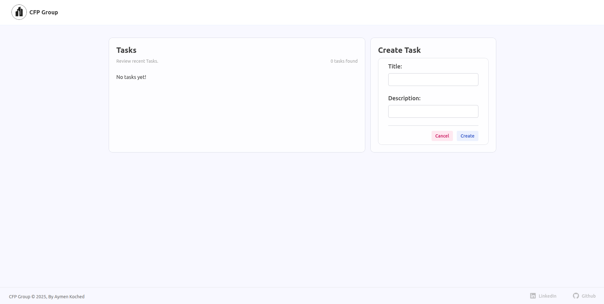
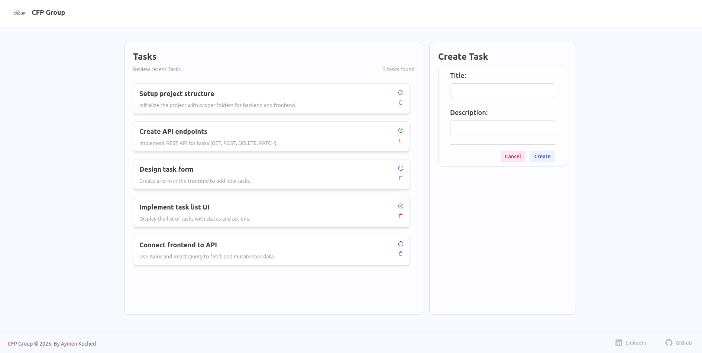
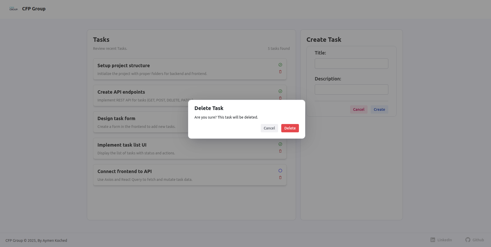

# 📋 Task Management App – Fullstack (React + TypeScript)

## 👨‍💻 Aymen Koched
Application de gestion de tâches simple destinée à une équipe interne. Ce projet fullstack en TypeScript utilise :
- Backend : Express + Zod
- Frontend : React + Next.js + React Query + React Hook Form + Zod

## 🚀 Fonctionnalités
### ✅ Backend (Express + TypeScript)
- GET /tasks : Liste des tâches
- POST /tasks : Création d'une nouvelle tâche
- DELETE /tasks/:id : Suppression par ID
- PATCH /tasks/:id (optionnel) : Mise à jour du statut (pending ou done)
- Données stockées en mémoire (pas de base de données)
- Validation des entrées via Zod
- Gestion des erreurs simple et explicite
### 💻 Frontend (React + TypeScript)
- Affichage de la liste des tâches
- Formulaire d'ajout de tâche
- Suppression d'une tâche
- (Bonus) Mise à jour du statut par un bouton
- Appels API isolés dans un service
- UI simple, claire, avec composants réutilisables

## 🛠️ Stack Technique
| Côté Backend      | Côté Frontend   |
| ----------------- | --------------- |
| Express           | React + Next.js |
| TypeScript        | TypeScript      |
| Zod               | Zod             |
| Nodemon + ts-node | React Query     |
| Docker            | React Hook Form |

## 📸 Aperçu de l’interface
### 🗂️ Liste des tâches


### ➕ Ajouter une tâche


### 🗑️ Supprimer une tâche


## 🐳 Lancer le projet avec Docker
```bash
# Démarrer toute la stack (backend + frontend)
npm run stack:up

# Arrêter la stack
npm run stack:down
```

## 📦 Lancer manuellement
### Backend
```bash
cd backend
npm install
npm run dev 
```
### Frontend
```bash
cd frontend
npm install
npm run dev
```

## 📁 Structure du projet
```bash
cfp/
├── backend/                # API Express en TypeScript
│   └── src/
│       ├── config/
│       ├── controllers/
│       ├── middlewares/
│       ├── models/
│       ├── requests/
│       ├── responses/
│       ├── routes/
│       ├── utils/
│       ├── app.ts/
│       └── server.ts/
├── frontend/               # Application React (Next.js)
│   └── src/
│       ├── components/
│       ├── hooks/
│       ├── responses/
│       ├── page.tsx
│       └── layout.tsx/
├── docker-compose.yml      # Docker multi-services
├── package.json            # Scripts globaux
└── README.md               # Ce fichier
```

## 💬 Commentaires Techniques
- Pourquoi Express ? Simplicité et flexibilité.
- Zod est utilisé à la fois côté backend et frontend pour garantir une validation cohérente.
- React Query facilite le cache et la synchro avec le backend.
- React Hook Form gère efficacement les formulaires avec validation via Zod.
- Architecture claire avec séparation des responsabilités (routes/services/types/hooks).

## 📩 Contact
For questions or feedback, please reach out at [aymenkoched@gmail.com].
